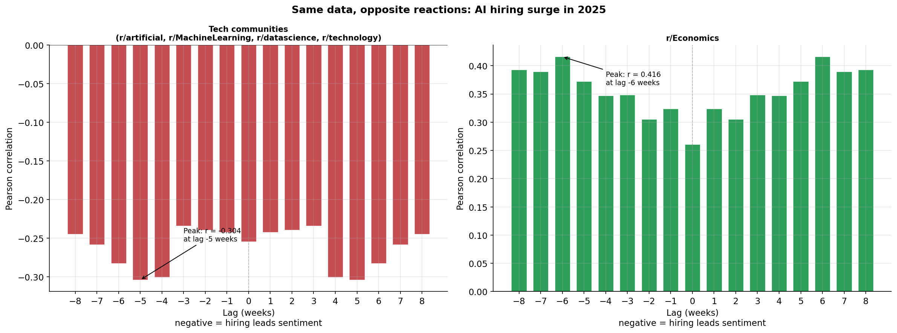
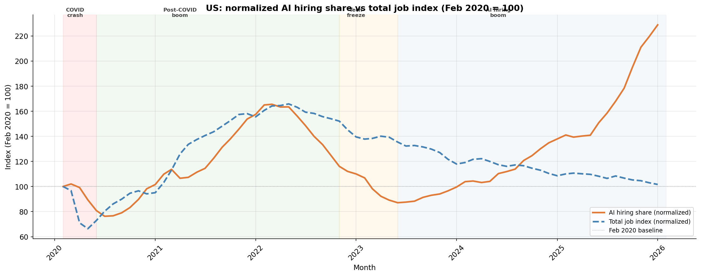
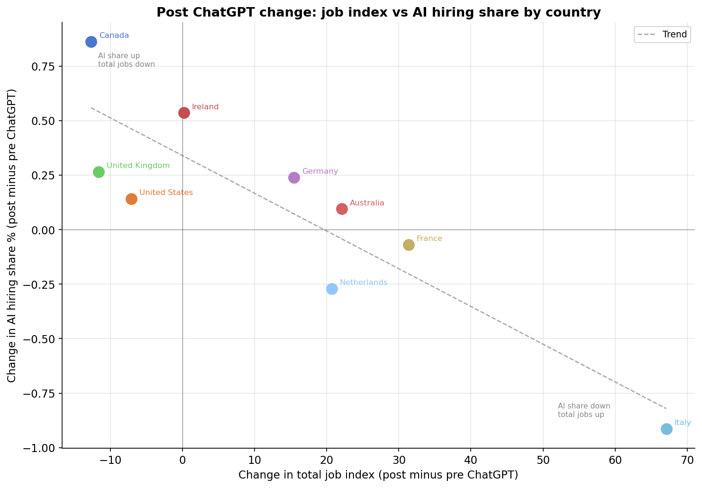

# The AI Jobs Debate: Perception vs Reality
**NLP Pipeline Analyzing Public Sentiment vs Labor Market Demand**  
*Columbia University APAN 5205 — Applied Machine Learning II*

---

## Overview

Do public perceptions of AI's impact on employment match what's actually happening in the labor market? This project places Reddit discourse directly alongside real hiring data to find out.

We built a **5-stage NLP pipeline** analyzing 9,215 Reddit posts and 38,126 comments across 9 subreddits, cross-referenced with a 7-year daily dataset of AI-related job postings across 9 countries from Indeed's Hiring Lab.

### The Key Finding

Tech practitioners and economists read the **same hiring signal** and arrive at **opposite conclusions**:



- **Tech communities** (r/artificial, r/MachineLearning, r/datascience, r/technology): negative correlation (r = -0.304) with a **5-week lag** — more AI in job postings = displacement threat
- **r/Economics**: positive correlation (r = +0.416) with a **6-week lag** — more AI in job postings = productivity investment

The 5–6 week lag represents the processing time for labor market data to percolate through commentary, news, and peer discussion into measurable Reddit sentiment.

---

## The Great Divergence

AI hiring share has surged to **228% of its pre-pandemic baseline** while total job postings returned to ~100%. Employers are embedding AI requirements into existing roles rather than creating new ones.



---

## Analytical Pipeline

```
Reddit (Arctic Shift API)          Indeed Hiring Lab
9,215 posts + 38,126 comments      23,292 daily records × 9 countries
         │                                    │
         ▼                                    ▼
   Text Preprocessing               Time-Series Analysis
   (NLTK + spaCy)                   (5 macro episodes identified)
         │                                    │
    ┌────┴────┐                               │
    ▼         ▼                               │
  VADER    TF-IDF                             │
Sentiment  + LDA                              │
    │     Topics                              │
    └────┬────┘                               │
         ▼                                    │
   Daily Sentiment ◄─── Cross-Dataset ───► Weekly AI Share
   Time Series          Lag Correlation       Time Series
                        (-8 to +8 weeks)
                              │
                              ▼
                     4 Integrated Findings
```

### Stage 1: Text Preprocessing
Dual-track tokenization (V2 retains query keywords, V3 removes them) using NLTK lemmatization + custom stopword lists. spaCy POS tagging for noun-only TF-IDF and noun+verb+adj LDA tracks.

### Stage 2: Sentiment Analysis (VADER)
Rule-based sentiment scoring optimized for Reddit's informal language. Posts carry higher mean sentiment (0.28) than comments (0.19) — posts are agenda-setting, comments are reactive and more skeptical.

### Stage 3: TF-IDF & N-gram Analysis
Community-specific vocabulary extraction. Key finding: "dot com bubble" appears as a top trigram — users are pattern-matching AI disruption to the 2001 collapse, not panicking naively.

### Stage 4: LDA Topic Modeling
5 topics per sentiment-stratified subset. Negative AI discourse is embedded in broader economic anxiety (tariffs, interest rates, institutional distrust), not primarily about job replacement.

### Stage 5: Cross-Dataset Correlation
53 weekly observations, lagged sweep from -8 to +8 weeks per community. Identifies the direction, magnitude, and timing of sentiment response to real hiring signals.

---

## Three Community Profiles

| Profile | Subreddits | Sentiment | Key Insight |
|---|---|---|---|
| **Most Anxious** | r/technology, r/Economics | Lowest median, most negative outliers | Tech professionals feel AI requirements threaten their roles |
| **Most Optimistic** | r/careerguidance, r/datascience | Median ≈ 0.9 | Data scientists view rising AI demand as skill validation |
| **Most Polarized** | r/jobs | Widest IQR | AI is simultaneously resume-optimizer and job-killer |

---

## Global Patterns: 9 Countries



Two mechanisms drive AI hiring share across markets: **adoption effect** (US, Germany — AI requirements grow even as total postings contract) vs **denominator effect** (France, Italy — general hiring boom dilutes AI share percentage).

---

## Repository Structure

```
nlp-ai-jobs-sentiment/
├── README.md
├── requirements.txt
├── .gitignore
├── notebooks/
│   ├── 01_data_collection_reddit.ipynb
│   ├── 02_data_collection_indeed_ai.ipynb
│   ├── 03_data_collection_indeed_total.ipynb
│   ├── 04_reddit_nlp_analysis.ipynb       ← Core NLP pipeline
│   ├── 05_indeed_time_series.ipynb        ← Labor market analysis
│   └── 06_cross_dataset_correlation.ipynb ← Cross-dataset findings
└── charts/
    ├── combined/    (4 cross-dataset charts)
    └── indeed/      (7 labor market charts)
```

---

## Tech Stack

`Python` · `pandas` · `NumPy` · `NLTK` · `spaCy` · `scikit-learn`  
`Gensim (LDA)` · `VADER` · `matplotlib` · `seaborn` · `WordCloud` · `SciPy`

---

## Data Sources

- **Reddit:** Arctic Shift API — 9 subreddits, full year 2025, AI + employment keywords
- **Indeed Hiring Lab:** Daily AI hiring share + total job posting index, 9 countries, 2019–2026

Data files are not included in this repository due to size and privacy constraints. The data collection notebooks (`01`–`03`) contain the full reproduction pipeline.

---

## How to Reproduce

```bash
pip install -r requirements.txt
python -m spacy download en_core_web_sm

# Run notebooks in order:
# 01-03: Data collection (requires API access)
# 04: Reddit NLP analysis → outputs daily sentiment CSVs
# 05: Indeed time-series analysis → outputs indeed_daily_2025.csv
# 06: Cross-dataset correlation → outputs final findings
```

---

## Disclaimer

Academic project for educational purposes. Reddit data collected from public posts.  
Indeed data sourced from Indeed's Hiring Lab public research datasets.
